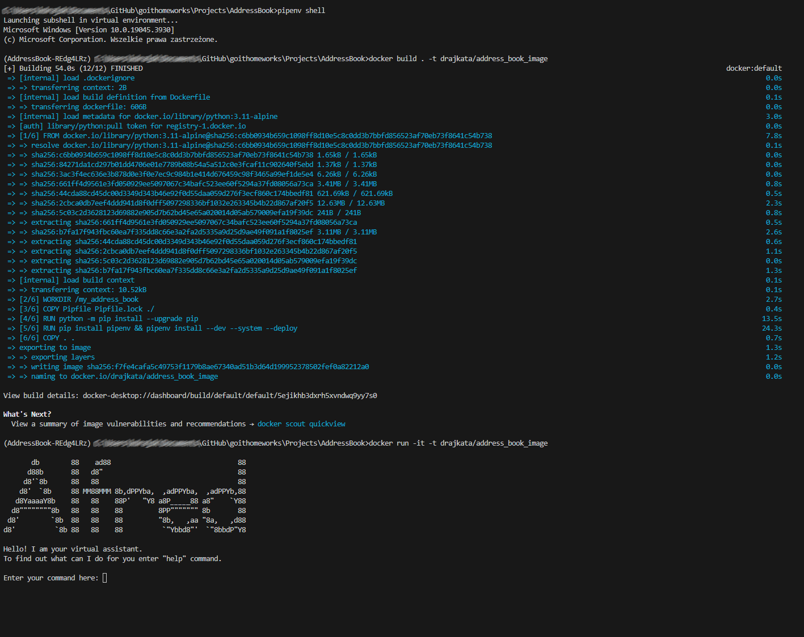

## Setup - introduction

If you are a developer, plese start instructions from [Stage 1](https://github.com/drajkata/goithomeworks/blob/main/Projects/AddressBook/README.md#stage-1---setup-pipenv).
If you are a user, please start instructions from [Stage 2](https://github.com/drajkata/goithomeworks/blob/main/Projects/AddressBook/README.md#stage-2---setup-docker).

## Stage 1 - Setup pipenv

1. **Clone the Repository:**

   - Clone this repository into a folder of choice on your local machine using the following command:
     ```
     git clone https://github.com/drajkata/goithomeworks/tree/main/Projects/AddressBook
     ```

2. **Install pipenv:**

   - Install pipenv if you haven't installed yet:
     ```
     pip install pipenv --user
     ```

3. **Setup the Application:**

   - Navigate to the project directory:
     ```
     cd AddressBook
     ```
   - Run the following command to install application with the exact version of modules, which are setted in the Pipfile.lock:
     ```
     pipenv install --deploy
     ```

4. **Run the pipenv:**

   - Start the pipenv using the following command:
     ```
     pipenv shell
     ```

5. **Run the Application:**

   - Start the Address Book application using the following command:
     ```
     pipenv run python address_book/main.py
     ```

6. **Exit pipenv:**

   - To exit pipenv use the following command:
     ```
     exit
     ```

7. **Uninstall environment:**
   - To uninstall environment of pipenv use the following command:
     ```
     pipenv --rm
     ```
   - You can verify that the operation was successful by checking if the system finds a virtual environment for this location. Use the following command:
     ```
     pipenv --where
     ```

Activate virtual environment with pipenv and go next to the Stage 2.

## Stage 2 - Setup docker

1. **Creating an image**

- To create an image use the following command:

  ```
  docker build . -t [your_profile_in_docker_hub]/[image_name]
  ```

- To check your images use the following command:
  ```
  docker image ls
  ```

2. **Spin up a new container**

- To spin up a new container use the following command:

  ```
  docker run -it -t [your_profile_in_docker_hub]/[image_name]
  ```

  Note: "-t [your_profile_in_docker_hub]/[image_name]" is optionally, if you want to connect the image with Docker Hub.

3. **Run the application from the running container**

- To check your container ID use the following command:
  ```
  docker container ls
  ```
- To use the container that is already running use the following command:

  ```
  docker exec -it [container_id] /bin/bash
  ```

  Use bin/bash or bin/sh - it depends on your system, which command is correct.

- To exit from your application use the following command:
  ```
  exit
  ```

## Example of use

**Example of restarting the program from the beginning**


